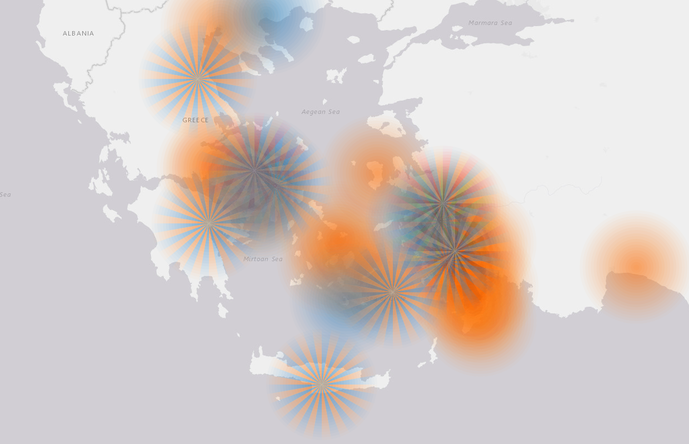

# leaflet-segment-charts
## demo
 - [demo](https://adammertel.github.io/leaflet-segments-charts/demo/)

## dependencies
 - [leaflet ~1.6.0](leafletjs.com)
 - [leaflet-semicircle ^2.0.0 ](https://github.com/jieter/Leaflet-semicircle)

## methods
 - **addLayer** (L.geoJSON.feature)
 - **addLayers** (L.geoJSON)

## options
 - **maxDist** (int) maximal distance of each marker,
 - **maxOpacity** (float) opacity of the inner circle,
 - **opacityDecrease** (float) coefficient that represents the pace of opacity decrease of outer circles/steps,
 - **noSteps** (int) - number of innercircles,
 - **circleSegmentAngle** (int) - angle of sequence
 - **propertyName** (String) - name of the attribute the sequences will be build from (the value of this property has to be array)
 - **colors** (Object) - key-value pairs of attribute values and particular segment colors

## how to use
 - see `./demo`

## how to build:
 - install npm modules `npm install`
 - run build command `npm run build`
 - `npm start` command watches `./src` folder and runs `npm run build` on changes

## todo
 - input control
 - maxDist based on property
 - better documentation
 - opacity control
 - better solution for sequence angles
 - ...